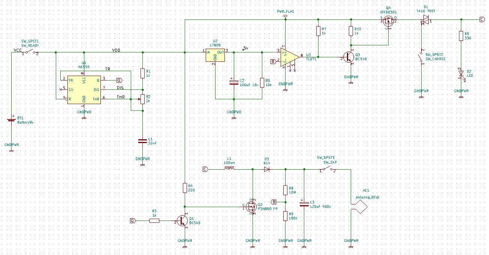
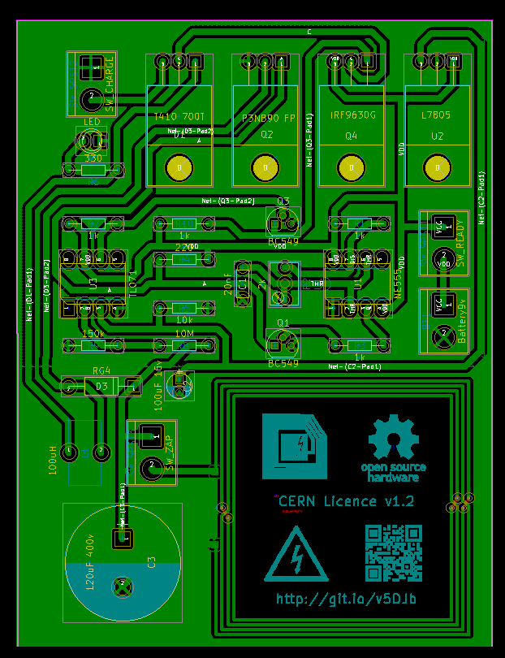
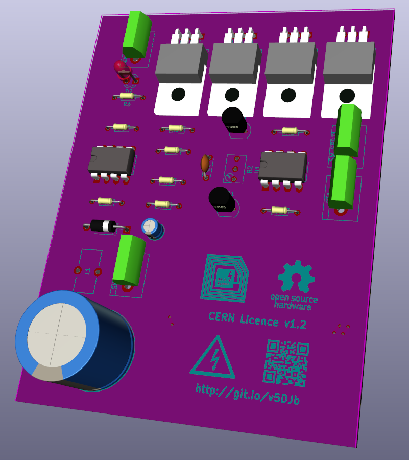

# rfid-zapper

RFID Zapper sirve para quemar, dejando fuera de funcionamiento de forma irreversible los chips tipo RFID como el que se encuentran en llaves de puertas electronicas, tarjetas de transporte público, pasaporte, boletas de voto electrónico, etc. No deja marca visible en absoluto ni emite ruido alguno. 

Este dispositivo debe utilizarse SOLO con fines didácticos o de pruebas. El mal uso del mismo **puede ocasionar serios daños en dispositivos electrónicos.**

**ATENCIÓN: Este dispositivo tiene una salida en ALTO VOLTAJE. Puede ocasionar daños en el organismo o incluso la muerte si se aplica la descarga sobre una persona en forma directa sin antena directa. Debe manipularse adecuadamente. NO utilizar sin protección adecuada.**

## Esquema eléctrico

## Placa

## Lista de materiales

Description | Part | References | Value | Footprint | Quantity Per PCB
---- | ---- | ---- | ---- | ---- | ---- 
single battery cell | Battery_Cell | BT1 | Battery9v | bornier2 | 1
Polarised capacitor | CP | C2 | 100uF 16v | CP_Radial_D4.0mm_P2.00mm | 1
Polarised capacitor | CP | C3 | 120uF 400v | CP_Radial_D18.0mm_P7.50mm | 1
Unpolarized capacitor | C | C1 | 20nF | C_Disc_D4.3mm_W1.9mm_P5.00mm | 1
LED generic | LED | D2 | LED | LED_D3.0mm | 1
Diode | D | D3 | RG4 | D_A-405_P10.16mm_Horizontal | 1
triode for alternating current (TRIAC) | Q_TRIAC_AAG | D1 | T410 700T | TO-220_Horizontal | 1
Inductor with Iron Core | L_Core_Iron | L1 | 100uH | Choke_Toroid_5x10mm_Vertical | 1
45V Vce, 0.1A Ic, NPN, Small Signal Transistor, TO-92 | BC549 | Q1 Q3 | BC549 | TO-92_Molded_Narrow | 2
6.5A, 200V, 0.800 Ohm, P-Channel Power MOSFET | IRF9540N-RESCUE-RFIDZapper | Q4 | IRF9630G | TO-220_Horizontal | 1
N - CHANNEL 900V - 4 ohm - 3.5 A PowerMESH MOSFET | IRF3205 | Q2 | P3NB90 FP | TO-220_Horizontal | 1
Resistor | R | R8 | 10M | R_Axial_DIN0204_L3.6mm_D1.6mm_P7.62mm_Horizontal | 1
Resistor | R | R5 | 10k | R_Axial_DIN0204_L3.6mm_D1.6mm_P7.62mm_Horizontal | 1
Resistor | R | R9 | 150k | R_Axial_DIN0204_L3.6mm_D1.6mm_P7.62mm_Horizontal | 1
Resistor | R | R1 R3 R7 R10 | 1k | R_Axial_DIN0204_L3.6mm_D1.6mm_P7.62mm_Horizontal | 4
Resistor | R | R4 | 220 | R_Axial_DIN0204_L3.6mm_D1.6mm_P7.62mm_Horizontal | 1
Potentionmeter | POT | R2 | 2k | Potentiometer_Trimmer_Bourns_3266Y | 1
Resistor | R | R6 | 330 | R_Axial_DIN0204_L3.6mm_D1.6mm_P7.62mm_Horizontal | 1
Switch | SW_SPST | SW_SPST2 | SW_CHARGE | bornier2 | 1
Switch | SW_SPST | SW_SPST1 | SW_READY | bornier2 | 1
Switch | SW_SPST | SW_SPST3 | SW_ZAP | bornier2 | 1
5V Voltage regulator | L7805 | U2 | L7805 | TO-220_Horizontal | 1
555-series timer IC | NE555 | U1 | NE555 | DIP-8_W7.62mm_LongPads | 1
Low-Noise JFET-Input Operational Amplifier | TL071-RESCUE-RFIDZapper | U3 | TL071 | DIP-8_W7.62mm_LongPads | 1

Las resistencias son todas de 1/8W o 1/4W. Las llaves/switches y la batería se conectan con borneras o pines. Es recomendable incorporar un pequeño disipador al Q2 (P3NB90).

## Licencia

RFID Zapper es un proyecto libre realizado por [*Manolo Envido*](https://twitter.com/Envido32), basado en el diseño presentado en la serie de videos de *The Post Apocalyptic Inventor* 

https://www.youtube.com/watch?v=E_Nsf0uU8IY&list=PLxaGnte1Dq0my2dtPL5y8sPR7xYXRrOCb

Libre para utilizar, modificar, compartir y demás bajo los términos de la licencia [CERN Open Hardware Licence v1.2](LICENSE).
