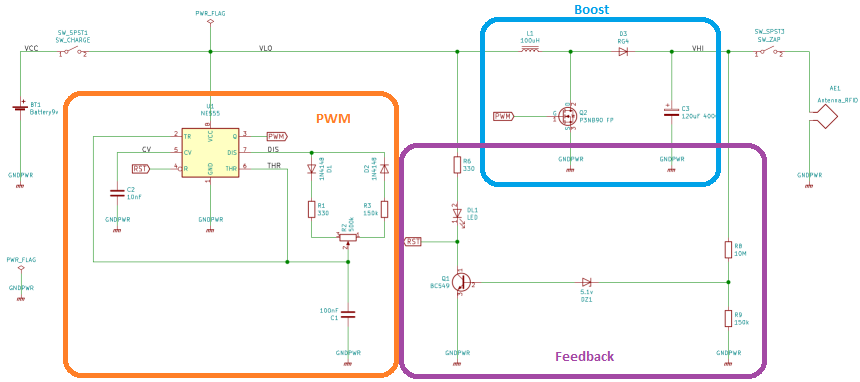
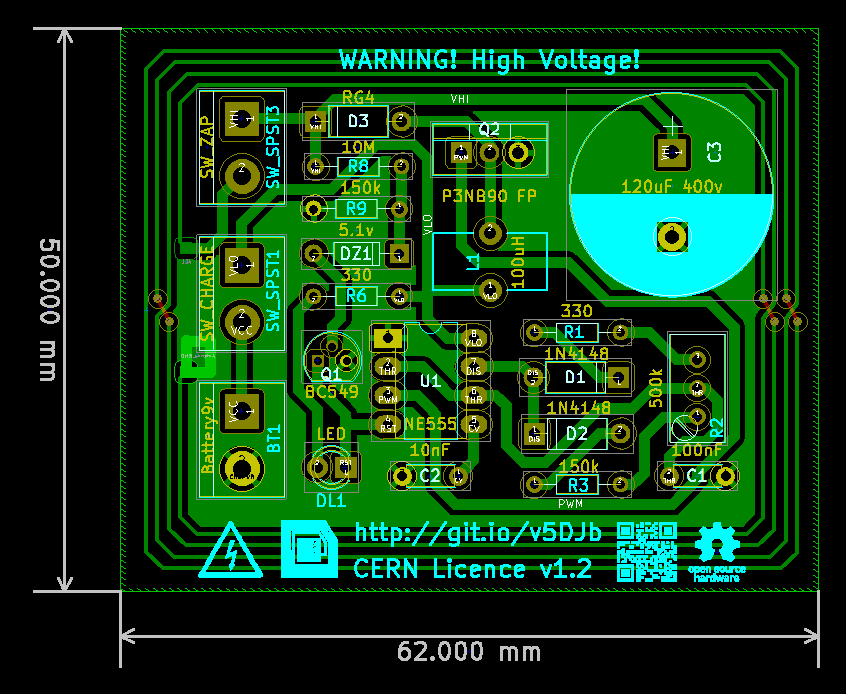
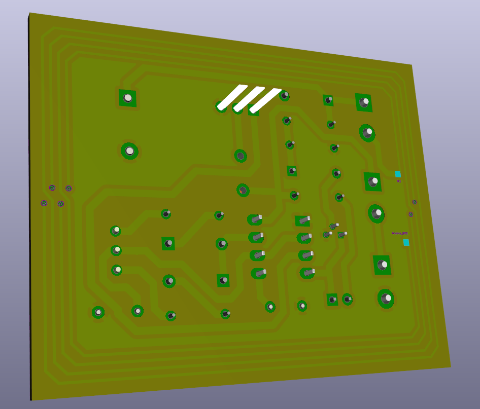

# RFID Zapper

RFID Zapper sirve para quemar, dejando fuera de funcionamiento de forma irreversible los chips tipo RFID como el que se encuentran en llaves de puertas electronicas, [tarjetas de transporte público](https://www.sube.gob.ar/), [pasaportes](https://www.digitalcourage.de/), [boletas de voto electrónico](https://youtu.be/bJT6KLP6tWA), etc. No deja marca visible en absoluto ni emite ruido alguno. 

Este dispositivo debe utilizarse SOLO con fines didácticos o de pruebas. El mal uso del mismo **puede ocasionar serios daños en dispositivos electrónicos.**

**ATENCIÓN! Este dispositivo tiene una salida en ALTO VOLTAJE. Puede ocasionar daños en el organismo o incluso la muerte si se aplica la descarga sobre el cuerpo. Debe manipularse adecuadamente. No utilizar sin protección adecuada.**

## Licencia

 

RFID Zapper es un proyecto libre realizado por [*Manolo Envido*](https://twitter.com/Envido32), basado en el diseño presentado en la serie de videos de [*The Post Apocalyptic Inventor*](https://www.youtube.com/watch?v=E_Nsf0uU8IY&list=PLxaGnte1Dq0my2dtPL5y8sPR7xYXRrOCb).

Libre para utilizar, modificar, compartir y demás bajo los términos de la licencia [CERN Open Hardware Licence v1.2](LICENSE).

## Principio de funcionamiento

Se trata de un circuito elevador de tensión alimentado por una batería alcalina de 9v. Este elevador carga el capacitor y luego al cerrar el segundo interruptor se descarga el capacitor a través de la antena RFID. Esto genera un pulso electromagnético que al ser captado por un chip RFID lo utilizara como alimentación. Al ser un pulso de alta intensidad (y corta duración) la energía absorbida por el chip sera más alta que la soportada por el integrado probocándole un daño irreparable de forma totalmente silenciosa e invisible.

El circuito elevador de tensión es del tipo [boost](https://en.wikipedia.org/wiki/Boost_converter) alimentado por una [batería alcalina de 9v](https://en.wikipedia.org/wiki/Nine-volt_battery). Este circuito es controlado por un [PWM](https://en.wikipedia.org/wiki/Pulse-width_modulation) básico realizado con el [Timer 555](https://en.wikipedia.org/wiki/555_timer_IC) y controlado por el potenciómetro, se recomienda evitar un ciclo de trabajo del PWM mayor al 50% para evitar daños a la batería. Una vez cargado el capacitor el circuito de feedback enciende el LED y desactiva el Timer 555.

## Lite Edition

Menos componentes, más compacto. 

[***Made with***](http://kicad-pcb.org/)

 

[***Order in PCBWay***](https://www.pcbway.com/project/shareproject/RFID_Zapper.html)

## Lista de materiales

Description | Part | References | Value | Footprint | Quantity Per PCB
---- | ---- | ---- | ---- | ---- | ---- 
Bornier | 2x1 | SW_SPST1 SW_SPST2 BT1 | SW_CHARGE SW_ZAP Baterry9v | Bornier | 3
Switch | DPDT | SW_SPST1 SW_SPST2 | SW_CHARGE SW_ZAP | Bornier | 1
Battery Cell | Baterry9v | BT1 | Alkaline 9v | Bornier | 1
Timer 555 IC | NE555 | U1 | NE555 | DIP 8 W7.62mm | 1
Capacitor | Ceramic | C1 | 100nF | Disc 4.3mm W1.9mm P5.00mm | 1
Capacitor | Ceramic | C2 | 10nF | Disc 4.3mm W1.9mm P5.00mm | 1
Capacitor | Polarised | C3 | 120uF 400v | Radial D18.0mm P7.50mm | 1
LED | Generic | DL1 | Any colour | LED 3.0mm | 1
Diode | Ultra Fast Recovery Rectifier | D3 | RG4 | P10.16mm | 1
Diode | Generic | D1 D2 | 1N4148 | P10.16mm | 2
Diode | Zenner v5.1 | DZ1 | 1N4733A | P10.16mm | 1
PowerMESH MOSFET | N-CHANNEL 900V 4ohm 3.5 A | Q2 | P3NB90 FP IRF3205| TO-220 | 1
Inductor | With Iron Core | L1 | 100uH | Toroid 5x10mm | 1
Small Signal Transistor | NPN 45V Vce 0.1A Ic | Q1 | BC549 | TO-92 | 1
Resistor | Generic | R1 R6 | 330ohm 1/8w | L3.6mm D1.6mm P7.62mm | 2
Resistor | Generic | R3 R9 | 150kohm 1/8w | L3.6mm D1.6mm P7.62mm | 2
Resistor | Generic | R8 | 10Mohm 1/8w | L3.6mm D1.6mm P7.62mm | 1
Potentionmeter | Trimmer | R2 | 500kohm 1/8w | POT | 1

